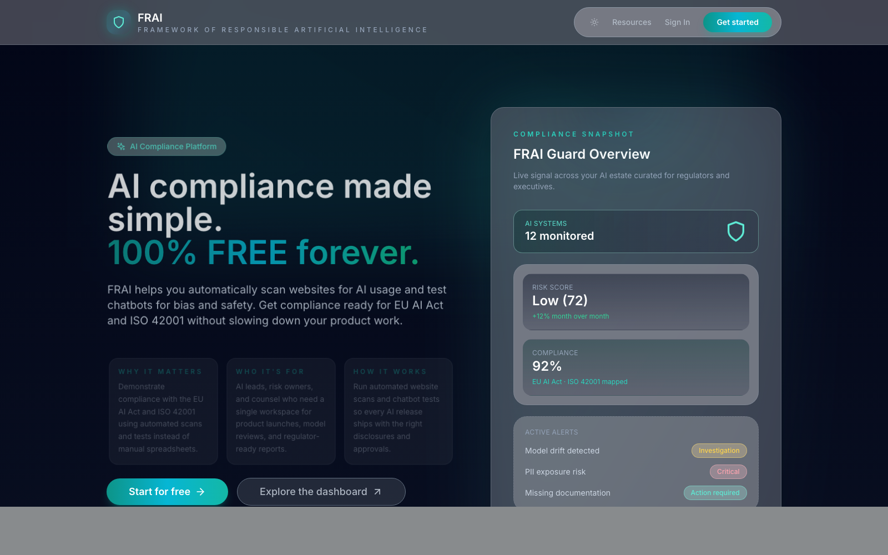
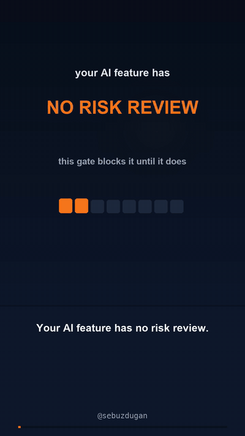

<div align="center">

<pre>

 ███████████ ███████████     █████████   █████
░░███░░░░░░█░░███░░░░░███   ███░░░░░███ ░░███ 
 ░███   █ ░  ░███    ░███  ░███    ░███  ░███ 
 ░███████    ░██████████   ░███████████  ░███ 
 ░███░░░█    ░███░░░░░███  ░███░░░░░███  ░███ 
 ░███  ░     ░███    ░███  ░███    ░███  ░███ 
 █████       █████   █████ █████   █████ █████
░░░░░       ░░░░░   ░░░░░ ░░░░░   ░░░░░ ░░░░░ 
                                 
</pre>

</div>

# FRAI · Framework of Responsible Artificial Intelligence


**Live platform:** [frai.cc](https://www.frai.cc/)



FRAI is an open-source toolkit that helps teams launch AI features responsibly. It guides you through evidence gathering, scans your code, and assembles documentation you can hand to reviewers: implementation checklists, model cards, risk files, evaluation reports, and compliance-aware RAG indexes. The toolkit ships as four packages that work together:

- `frai` – the command-line app with ready-to-run workflows.
- `frai-core` – the reusable SDK that powers the CLI and any custom integrations.
- `frai-agent` – a LangChain-powered conversational agent for FRAI workflows.
- `frai-gate` – the **FRAI Gate**: a guided spec template plus a validator and Claude Agent SDK pipeline that block AI features from being specced without answering the responsible-AI questions. (The matching agent skill lives in [frai-skills](https://github.com/sebuzdugan/frai-skills).)

## FRAI Ecosystem

FRAI is growing into a connected set of responsible AI tools for scanning, testing, documentation, evaluation, and compliance workflows.

| Project | What it does | Links |
|---------|--------------|-------|
| FRAI Platform | Free AI compliance platform for website scans, chatbot tests, compliance snapshots, and responsible AI workflows. | [Website](https://www.frai.cc/) |
| FRAI CLI / SDK | Open-source CLI and reusable SDK for responsible AI docs, code scanning, RAG indexing, evaluations, and governance workflows. | [GitHub](https://github.com/sebuzdugan/frai) |
| FRAI Chat | Browser-based responsible AI copilot with grounded RAG, citations, EU AI Act tier classification, model-card drafting, and risk-file drafting. | [GitHub](https://github.com/sebuzdugan/frai-chat) · [Live demo](https://sebuzdugan.github.io/frai-chat/) |
| FRAI Benchmark | Open-source safety and compliance benchmark with a model registry, test suites, automated runs, and an interactive leaderboard. | [GitHub](https://github.com/sebuzdugan/frai-benchmark) · [Leaderboard](https://sebuzdugan.github.io/frai-benchmark/) |
| FRAI Judge | Evaluation companion for judging AI outputs and supporting responsible AI review workflows. | [GitHub](https://github.com/sebuzdugan/frai-judge) |
| FRAI Skills | Agent skills for responsible AI engineering - the FRAI Gate spec workflow for AI coding agents (`npx skills add sebuzdugan/frai-skills`). | [GitHub](https://github.com/sebuzdugan/frai-skills) |

### Short Answer
- `frai-core` is the library/SDK. Use it when you are embedding FRAI capabilities into your own tools, servers, automations, or extensions.
- `frai` is the CLI. It wraps `frai-core` to deliver an end-user experience with no coding required.

### Why Keep Both?
- Independent versioning and stability  
  - `frai-core` can evolve APIs for integrators without forcing a CLI release.  
  - `frai` can improve UX/commands without breaking programmatic users.
- Reuse across surfaces  
  - `frai-core` powers the CLI today and future VS Code/Chrome extensions, GitHub Actions, internal CLIs, services, or SDKs.
- Smaller, focused installs  
  - Operators install the CLI.  
  - Builders install only the core library they need.

### When to Use Each
- Choose **`frai` (CLI)** when you want interactive prompts, one-command scans, RAG indexing, evaluation reports, or CI-friendly automation without writing code.
- Choose **`frai-core` (SDK)** when you want API access to FRAI capabilities from Node scripts, services, custom CLIs, extensions, or unusual I/O flows.
- Choose **`frai-agent`** when you want a conversational AI assistant that can intelligently orchestrate FRAI workflows using natural language commands.

### Concrete Examples
- CLI user: run `frai --scan` and `frai eval` in a repository to generate governance docs and audit reports.
- Library user: call `Documents.generateDocuments` from an internal portal to produce standardized docs, use `Scanners.scanCodebase` inside a GitHub Action, or embed `Rag.indexDocuments` inside a VS Code extension for grounded hints.
- Agent user: interact with `frai-agent` conversationally: "scan the repo and tell me what risks you found" or "generate docs based on this questionnaire data".

In short: CLI = product; Core = platform. They overlap in capability on purpose but target different audiences and distribution needs.

---

## Getting Started with the CLI

1. Install the published CLI:
   ```bash
   npm install -g frai
   ```
2. Configure your OpenAI API key (needed for AI-generated tips and evaluations):
   ```bash
   frai --setup
   ```
   Keys can be stored per-project (`.env`) or globally (`~/.config/frai/config`). You can also provide a one-off key using `frai --key sk-...`.
3. Run the interactive workflow:
   ```bash
   frai
   ```
   FRAI walks you through feature discovery, writes `checklist.md`, `model_card.md`, and `risk_file.md`, and optionally exports PDFs.

Generated artefacts live in your current working directory. Supplementary commands cover scanning, evaluation, RAG indexing, and fine-tuning governance.

---

## CLI Command Reference

| Command | Purpose |
|---------|---------|
| `frai [options]` | Interactive documentation workflow with backward-compatible shortcut flags. |
| `frai generate [options]` | Explicit interactive workflow command. |
| `frai scan [--ci] [--json]` | Scan the repository for AI/ML indicators. |
| `frai setup [--key <apiKey>] [--global]` | Store an OpenAI API key locally or globally. |
| `frai config` | Show key configuration status. |
| `frai docs list` / `frai docs clean` / `frai docs export` | Manage generated documentation. |
| `frai rag index [options]` | Build a local compliance-aware vector index. |
| `frai eval --outputs <file> [...]` | Run baseline evaluation metrics and write reports. |
| `frai finetune template` / `frai finetune validate <plan>` | Create or validate fine-tuning governance plans. |
| `frai gate init [--ci]` / `frai gate check <spec>` / `frai gate draft` | Responsible AI Gate for specs (delegates to `frai-gate`). |
| `frai update` | Check npm for the latest CLI release. |

### Default Command: `frai [options]`
Runs the interactive documentation flow. Optional flags add shortcuts:
- `--scan` – run code scanning before questions.
- `--ci` – exit after scanning when no AI indicators are detected.
- `--setup` – jump directly into key configuration.
- `--key <apiKey>` / `--global` – provide a key and optionally persist it globally.
- `--list-docs` / `--clean` – list or remove generated docs.
- `--export-pdf` – convert generated markdown to PDFs (requires `markdown-pdf`).
- `--show-config` – display key storage status.
- `--update` – check npm for a newer CLI version.

### `frai generate [options]`
Same workflow as the default command, but scoped to documentation only. Options mirror the defaults: `--scan`, `--ci`, `--key`, `--global`, `--export-pdf`, and `--show-config`.

### `frai scan`
Scans the repository for AI-related libraries, functions, and files. Use `--ci` for non-interactive mode or `--json` to emit raw JSON.

### `frai setup`
Guided API key storage. Supply `--key <apiKey>` for headless use and `--global` to persist at `~/.config/frai/config`.

### `frai config`
Prints whether local (`.env`) or global configuration holds an API key.

### `frai docs`
Utilities for generated artefacts:
- `frai docs list` – list detected `checklist.md`, `model_card.md`, and `risk_file.md`.
- `frai docs clean` – delete generated docs.
- `frai docs export` – export docs to PDF via `markdown-pdf`.

### `frai rag index [options]`
Create a lightweight JSON vector store for compliance policies.
- `--input <path>` – file or directory to index (defaults to cwd).
- `--output <path>` – target JSON file (defaults to `frai-index.json`).
- `--chunk-size <words>` – words per chunk (default 800).
- `--extensions <a,b,c>` – allowlisted extensions (default `.md,.markdown,.txt,.json,.yaml,.yml`).

### `frai eval`
Generate evaluation reports for model outputs.
- `--outputs <file>` *(required)* – JSON file with model outputs.
- `--references <file>` – JSON file with reference answers.
- `--report <path>` – output location (`frai-eval-report.json` by default).
- `--format <json|markdown>` – output format (defaults to JSON). Markdown reports include human-readable summaries for review boards.

### `frai finetune`
Fine-tuning governance helpers:
- `frai finetune template [--output <path>]` – write a governance template JSON (`frai-finetune-plan.json` by default).
- `frai finetune validate <plan> [--readiness]` – validate a plan and optionally print readiness checkpoints and summaries.

### `frai update`
Check npm for the latest `frai` release and print upgrade instructions.

---

## Using `frai-core` (SDK)

Install from npm:
```bash
pnpm add frai-core
```

`frai-core` exposes modular helpers that the CLI uses under the hood:
- `Questionnaire` – interactive question flows.
- `Documents` – generate checklists, model cards, and risk files.
- `Scanners` – static analysis for AI indicators.
- `Rag` – policy-grounded indexing utilities.
- `Eval` – baseline evaluation metrics and report writers.
- `Finetune` – governance templates, validation, and readiness scoring.
- `Config` & `Providers` – key management and LLM provider wiring.

Example: generate documentation programmatically.

```ts
import fs from 'fs/promises';
import inquirer from 'inquirer';
import { Documents, Questionnaire, Scanners } from 'frai-core';

const answers = await Questionnaire.runQuestionnaire({
  prompt: (questions) => inquirer.prompt(questions)
});

const { checklist, modelCard, riskFile } = Documents.generateDocuments({ answers });
const scan = Scanners.scanCodebase({ root: process.cwd() });
const aiContext = Documents.buildContextForAITips(answers);

await fs.writeFile('checklist.md', checklist);
await fs.writeFile('model_card.md', modelCard);
await fs.writeFile('risk_file.md', riskFile);
await fs.writeFile('scan-summary.json', JSON.stringify(scan, null, 2));
await fs.writeFile('ai-context.txt', aiContext);
```

Because `frai-core` is a regular ESM package, you can import only the modules you need and embed FRAI capabilities inside automation pipelines, CI jobs, or custom products.

---

## Using `frai-agent`

`frai-agent` is a LangChain-powered conversational agent that wraps FRAI scanning and documentation workflows behind a natural language interface. It provides an intelligent assistant that can scan repositories, generate documentation, and answer questions about your AI features.

### Getting Started

From the monorepo root:
```bash
pnpm agent:frai "Scan the repository and summarize AI risks."
```

### Interactive Mode

Launch a chat-style session:
```bash
pnpm agent:frai --interactive --verbose
```

The agent supports two tools:
- **`scan_repository`** – Scans your codebase for AI indicators using FRAI's static detectors.
- **`generate_responsible_ai_docs`** – Generates `checklist.md`, `model_card.md`, and `risk_file.md` from questionnaire answers.

### Example Usage

Scan a repository:
```bash
pnpm agent:frai "Scan the repo and tell me what AI-related code you found."
```

Generate documentation (with questionnaire answers):
```bash
pnpm agent:frai "Generate the docs with these answers: {
  \"core\": { \"name\": \"ReviewCopilot\", \"purpose\": \"assistant\" },
  \"impact\": { \"stakeholders\": [\"developers\"], \"impactLevel\": \"medium\" },
  \"data\": { \"sources\": [\"internal docs\"], \"retention\": \"30 days\" },
  \"performance\": { \"metrics\": [\"accuracy\"] },
  \"monitoring\": { \"strategy\": \"daily review\" },
  \"bias\": { \"mitigations\": [\"red teaming\"] }
}"
```

### API Usage

```ts
import { createFraIAgentExecutor } from "frai-agent";

const executor = await createFraIAgentExecutor({
  model: "gpt-4o-mini",
  verbose: true
});

const result = await executor.invoke({
  input: "scan the repository",
  chat_history: []
});

console.log(result.output);
```

`frai-agent` reuses FRAI's configuration system, so it automatically discovers your `OPENAI_API_KEY` from `.env` or global config.

---

## Responsible AI Gate (`frai gate`)

**The idea in one sentence: an AI feature spec is not done until seven responsible-AI questions are answered, and the gate blocks the build until they are.**



The seven checks: **risk tier** (EU AI Act-aligned; high-risk needs a named human sign-off) · **data & privacy** · **human oversight** · **evaluation thresholds** · **bias & fairness** · **monitoring & rollback** · **transparency & incidents**. Verdicts: ✅ PASS · ⚠️ WARN · ⛔ BLOCK (exit 1).

### Add it to any app in 60 seconds

Works in any repo - new app, existing app, any language:

```bash
npx frai-gate init --ci
```

That drops `FRAI-SPEC.md` (a spec template with the gate built in) and a GitHub Action that runs the gate on every PR. Answer the gate, then:

```bash
npx frai-gate check FRAI-SPEC.md
```

No API key needed for the check. Two smarter commands use a read-only agent (Claude Code auth or `ANTHROPIC_API_KEY`):

```bash
npx frai-gate draft                       # scans YOUR code and drafts the gate answers from it,
                                          # with file:line citations and NEEDS HUMAN INPUT markers
npx frai-gate check FRAI-SPEC.md --smart   # adversarial review: catches vague answers and
                                          # spec claims your code contradicts
```

### If you build with AI coding agents

```bash
npx skills add sebuzdugan/frai-skills
```

installs the `responsible-ai-spec` skill: every spec your agent writes includes the gate, and the agent is forbidden from self-approving high-risk features - a named human signs. Claude Code users in this repo also get `/rai-spec`.

Everything is also available as `frai gate ...` inside the main CLI, and programmatically via `import { validateSpec } from 'frai-gate'`. Worked example (the one from the demo video): [`examples/support-triage-demo/`](examples/support-triage-demo). Design notes: `docs/rai-gate-design.md`.

---

## Local Development

Clone the repository and work from source:
```bash
pnpm install
pnpm --filter frai run build
node packages/frai-cli/dist/index.js --help
```

During development you can install the CLI locally without publishing:
```bash
pnpm install --global ./packages/frai-cli
# then
frai --setup
```

Store your OpenAI key by running the CLI setup flow or setting `OPENAI_API_KEY` in `.env`.

---

## Publishing (Maintainers)

FRAI ships as two npm packages and they must be published independently.

1. Bump versions in `packages/frai-core/package.json` and `packages/frai-cli/package.json`. Update the CLI dependency to match the published `frai-core` version (drop `workspace:*`).
2. Build the CLI:  
   ```bash
   pnpm --filter frai run build
   ```
3. Publish `frai-core` first, then `frai`:  
   ```bash
   cd packages/frai-core && npm publish
   cd ../frai-cli   && npm publish
   ```
4. Verify on npm:  
   ```bash
   npm view frai versions --json
   npm view frai-core versions --json
   ```

---

## Learn More
- Website: [frai.cc](https://frai.cc)
- NPM package: [frai](https://www.npmjs.com/package/frai)
- docs/ai_feature_backlog.md – roadmap for AI capabilities.
- docs/eval_harness_design.md – evaluation harness design notes.
- docs/architecture-target.md – monorepo architecture.

*Framework of Responsible Artificial Intelligence*
