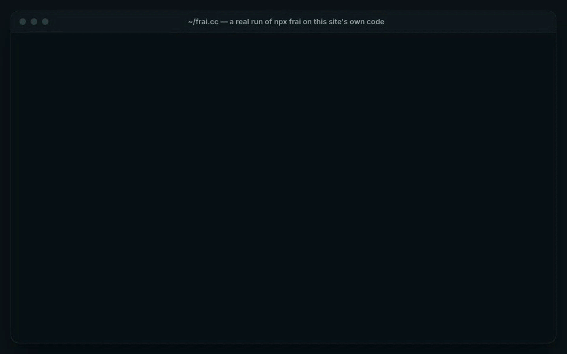
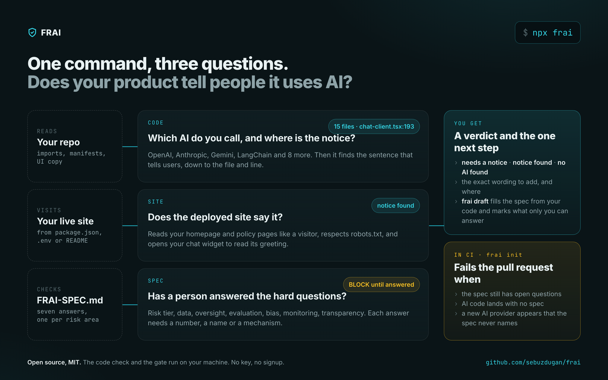
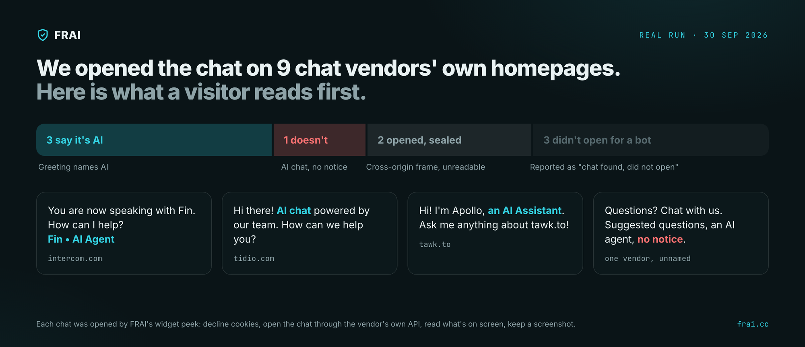
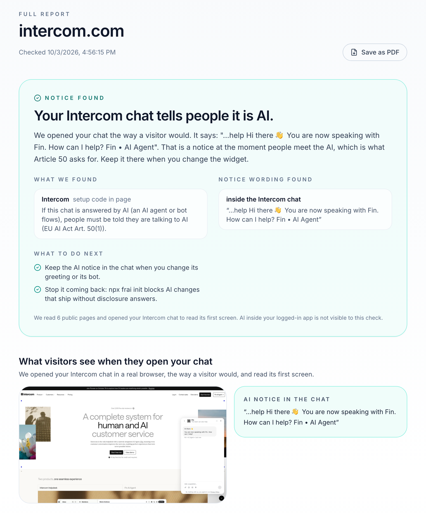

<div align="center">

# FRAI

**Does your product tell people it uses AI?**<br>
One command checks your code, your live site and your spec, and fails the pull request until the answer is yes.

[](https://www.npmjs.com/package/frai)
[](https://www.npmjs.com/package/frai)
[](LICENSE)
[](https://nodejs.org)



<sub>A real run on frai.cc's own code. Only step 4 is scripted: a stand-in answers the 15 open questions.</sub>

</div>

## Try it

```bash
npx frai                      # review this repo: code, live site, spec
npx frai check yoursite.com   # check any site, no repo needed
npx frai init                 # add the gate to every pull request
```

No key, no signup. Node 18 or newer.

## How it works



- **Code.** Finds AI SDKs and model calls (OpenAI, Anthropic, Gemini, LangChain and 8 more), then the sentence in your UI that tells people, down to the file and line.
- **Site.** Finds your URL in `package.json`, `.env` or the README, reads the homepage and policy pages like a visitor, and opens your chat widget to read what it says first.
- **Spec.** `FRAI-SPEC.md` asks seven questions: risk tier, data, oversight, evaluation, bias, monitoring, transparency. `frai draft` fills them from your code and writes `NEEDS HUMAN INPUT: <question>` wherever the code can't know. The gate blocks until a person answers.

## What it finds in the wild



Most AI notices live inside the chat, not on the page, so a page scan misses them. FRAI declines cookies, opens the chat through the vendor's own API, reads the first screen and keeps a screenshot. Where it can't read the chat, it says so instead of guessing.

## The report



`npx frai check yoursite.com --email you@company.com` (or [frai.cc](https://frai.cc)) sends the full report: up to 10 pages, the chat opened and quoted, a screenshot, the wording to add, and a PDF. Add `--watch` and it re-checks every month. All free.

## Why now

Since 2 August 2026, EU AI Act Article 50 says people must be told when they're talking to an AI or seeing AI-generated content. Fines reach €15M or 3% of global turnover. Model makers watermark their output for machines. Telling the person is your job, and it is the half that breaks quietly when someone swaps a chat widget or adds a second model.

## In CI

```yaml
- run: npx frai@latest --ci --offline
```

`frai init` writes this workflow for you. It fails when:

- the spec still has open questions,
- AI code lands with no spec,
- the code starts calling an AI provider the spec never names.

Drop `--offline` to also fail when the live site has no notice. The gate is deterministic: no model, no key. Add `--smart` for an AI review of vague answers.

## What leaves your machine

| | Runs where |
|---|---|
| Code scan, notice-in-code, gate | On your machine. Nothing is sent. |
| Site check | Through frai.cc, which visits your public site as [FRAIBot](https://frai.cc/bot) and respects robots.txt. Skip it with `--offline`. |
| `frai draft` | Your own Claude (Claude Code login or `ANTHROPIC_API_KEY`). Without one, frai.cc drafts it after listing the files it would send and asking you first. |

## Packages

| Package | |
|---|---|
| [`frai`](https://www.npmjs.com/package/frai) | The CLI. |
| [`frai-gate`](https://www.npmjs.com/package/frai-gate) | The gate alone: `npx frai-gate check FRAI-SPEC.md`, or `import { validateSpec } from 'frai-gate'`. |
| [`frai-core`](https://www.npmjs.com/package/frai-core) | Scanners and document helpers under the CLI. |

Building with coding agents? `npx skills add sebuzdugan/frai-skills` teaches them to write specs that include the gate.

## Contribute

```bash
pnpm install
pnpm --filter frai-gate build && pnpm --filter frai build
node packages/frai-cli/dist/index.js --help
```

The most useful contributions right now: AI SDKs we don't detect yet ([`code-checks.ts`](packages/frai-cli/src/code-checks.ts)), notice wording in other languages, and chat widgets that don't open for us. Issues and PRs welcome.

To release: bump the packages, point `frai`'s dependency ranges at the versions you're publishing (never `workspace:*`), build, then publish `frai-gate`, `frai-core` and `frai` in that order.

<sub>FRAI is a technical check, not legal advice. MIT licensed. Images are rendered from [`assets/source`](assets/source).</sub>
